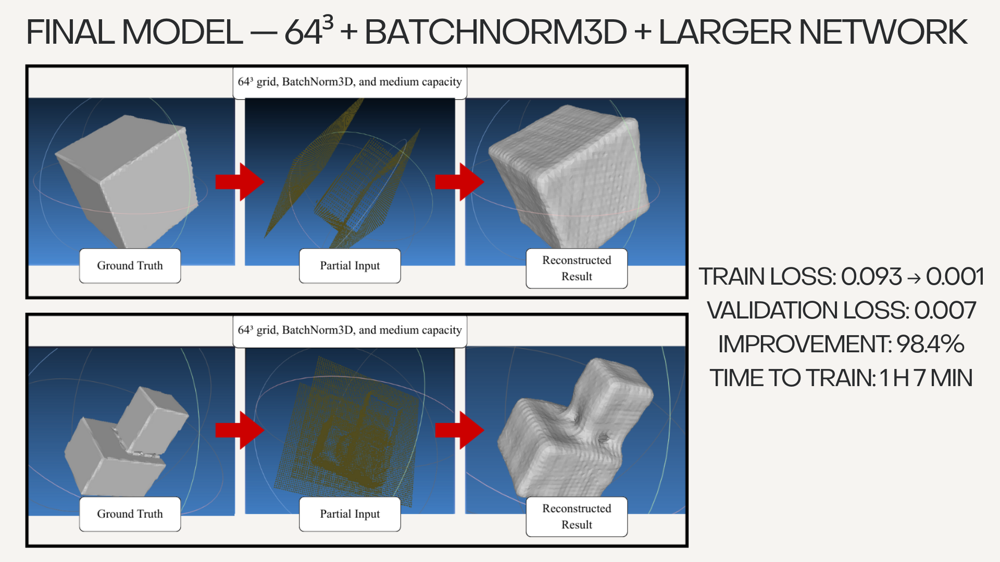
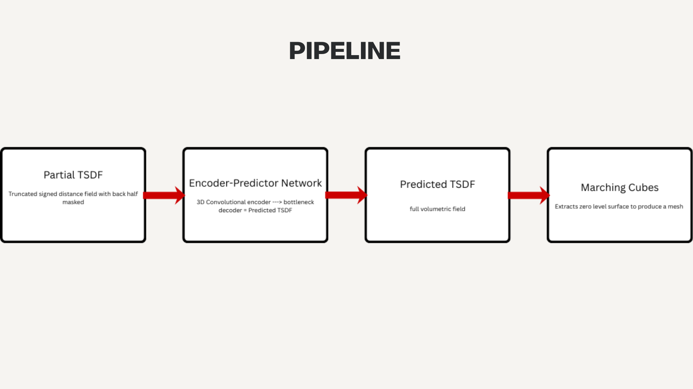
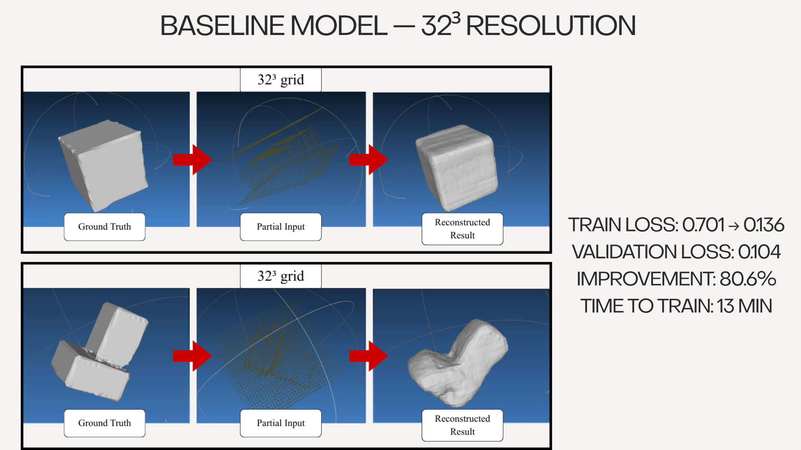
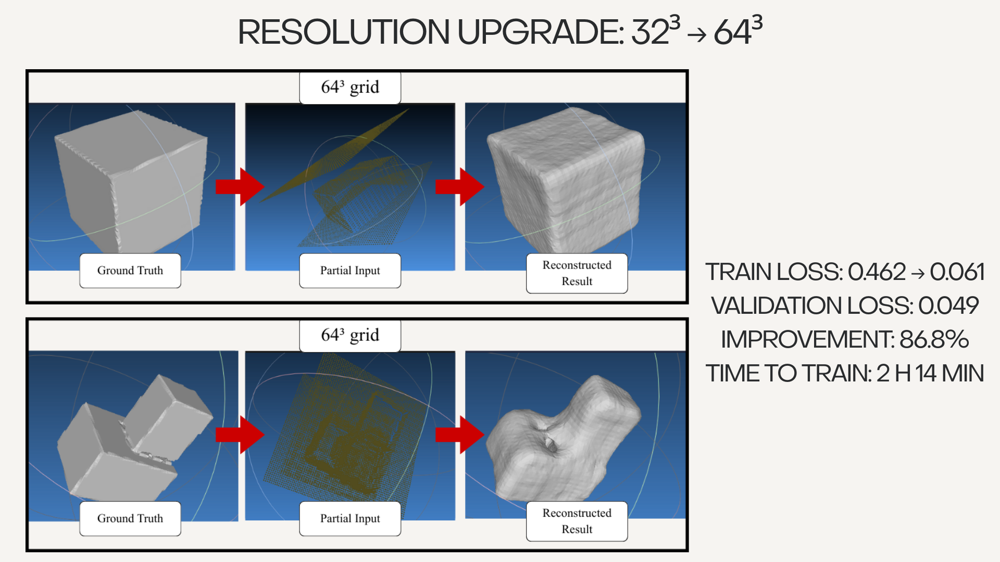

# 3D Shape Completion Using an Encoder–Predictor Network (EPN)

A PyTorch pipeline that learns to reconstruct missing 3D geometry from partial Truncated Signed Distance Field (TSDF) observations.

---

## Overview

Consumer-grade 3D scans often contain holes, occluded surfaces, and incomplete geometry. This project explores whether a lightweight 3D Encoder-Predictor Network can infer the missing structure of an object from a partial volumetric observation.

The current implementation uses synthetic primitives to develop and evaluate the reconstruction pipeline in a controlled setting before expanding to real mobile-phone scans.


## Example Reconstruction



---

## Current Features

* TSDF-based volumetric shape representation
* Partial scan simulation through half-space occlusion
* 3D Encoder–Predictor Network (EPN-style architecture)
* Marching Cubes mesh extraction
* Synthetic primitive dataset generation
* 32³ and 64³ voxel reconstruction experiments
* BatchNorm3D and increased model-capacity experiments
* Visual reconstruction comparison pipeline

---

## Pipeline

The current reconstruction pipeline:



---

## Methodology

### Data Generation

Synthetic 3D primitives are generated using Python scripts, including:

* Cubes
* Spheres
* Cylinders
* Combined cube structures forming L-shaped geometry

Each generated shape is converted into:

* Full TSDF volume
* Partial TSDF volume
* Occupancy grid
* Alignment bounds

The implementation can simulate incomplete observations using fixed-half, random-half, camera-axis, and spherical occlusion. Optional Gaussian noise can also be added to observed TSDF regions.

### Model Architecture

The reconstruction model is based on a lightweight Encoder–Predictor Network (EPN).

The architecture consists of:

* 3D convolutional encoder
* Latent bottleneck representation
* 3D convolutional decoder

The encoder extracts spatial geometric features from the partial TSDF input, while the decoder reconstructs the completed volumetric field.

### Mesh Reconstruction

After prediction, the Marching Cubes algorithm extracts the zero-level surface from the predicted TSDF volume to generate a reconstructed mesh.

Mesh extraction and visualization were used during the experimental evaluation; this repository currently focuses on data generation, TSDF preprocessing, and model training.

---

## Results

The project currently includes experiments comparing:

* 32³ vs 64³ voxel resolution
* Small vs medium-capacity models
* BatchNorm3D integration
* Reconstruction quality across primitive types

### Best Current Result

* Grid Resolution: 64³
* Architecture: Medium-capacity + BatchNorm3D
* Validation Loss: 0.007

Key findings:

* Higher voxel resolution significantly improves reconstruction quality
* BatchNorm3D improves stability and convergence
* Increased channel capacity improves reconstruction of more complex geometry
* Correct TSDF preprocessing was critical for stable training

### Experiment Progression

#### Baseline at 32³ Resolution



#### Resolution Upgrade from 32³ to 64³



#### Final 64³ Model with BatchNorm3D


---

## Repository Structure

```text
3d-shape-completion/
│
├── models/          # Network architectures
├── scripts/         # Training and preprocessing scripts
├── outputs/         # Reconstruction results and visualizations
├── docs/            # Reports, slides, and project documentation
├── data/            # Sample data / dataset structure
│
├── README.md
├── requirements.txt
└── .gitignore
```
## Setup

### 1. Clone the repository

```bash
git clone https://github.com/TarekElt/3d-shape-completion.git
cd 3d-shape-completion
```

### 2. Create a virtual environment

#### Windows PowerShell

```powershell
python -m venv .venv
.\.venv\Scripts\Activate.ps1
```

#### macOS or Linux

```bash
python3 -m venv .venv
source .venv/bin/activate
```

### 3. Install dependencies

```bash
python -m pip install --upgrade pip
pip install -r requirements.txt
```

PyTorch automatically uses CUDA when a compatible GPU and CUDA-enabled PyTorch build are available. Training also supports CPU and Apple Silicon MPS, although 64³ experiments are considerably faster on a GPU.

## Run the Pipeline

### 1. Generate synthetic meshes

```bash
python scripts/generate_primitives.py --out-root data/ModelNet10 --class simulated --n 200
```

This creates randomized training and testing meshes under `data/ModelNet10/simulated/`.

### 2. Convert the meshes to TSDF volumes

Create the output directory:

```powershell
New-Item -ItemType Directory -Force outputs/tsdf
```

Convert all generated meshes using Windows PowerShell:

```powershell
Get-ChildItem data/ModelNet10/simulated -Recurse -Filter *.off | ForEach-Object {
    python scripts/generate_tsdf.py `
        --file $_.FullName `
        --grid 64 `
        --partial-type random-half `
        --out ("outputs/tsdf/" + $_.BaseName + "_tsdf.npz")
}
```

Equivalent command for macOS or Linux:

```bash
mkdir -p outputs/tsdf

find data/ModelNet10/simulated -name "*.off" -print0 |
while IFS= read -r -d '' file; do
    name="$(basename "${file%.*}")"

    python scripts/generate_tsdf.py \
        --file "$file" \
        --grid 64 \
        --partial-type random-half \
        --out "outputs/tsdf/${name}_tsdf.npz"
done
```

### 3. Train the model

```bash
python scripts/train_model.py \
    --data-root outputs/tsdf \
    --pattern "*_tsdf.npz" \
    --G 64 \
    --model-mode medium \
    --epochs 20 \
    --batch-size 4 \
    --mixed-precision
```

Remove `--mixed-precision` when training without a CUDA GPU.

Checkpoints, epoch metrics, and optional TensorBoard logs are written to `outputs/checkpoints/`.


## Technologies Used

* Python
* PyTorch
* NumPy
* SciPy
* Trimesh
* CUDA and mixed-precision training
* TensorBoard
* Marching Cubes surface extraction

---

## Documentation

## Documentation

- [Technical Report](docs/technical_report.docx)
- [Project Presentation](docs/project_presentation.pdf)
- [Baseline Reconstruction Results](outputs/comparisons/baseline_model_32_resolution.png)
- [Resolution Upgrade Results](outputs/comparisons/resolution_upgrade_32_to_64.png)
- [Final Model Results](outputs/comparisons/final_model_64_batchnorm.png)

---

## Current Limitations

- Training data currently focuses on synthetic primitives
- Occlusion simulation approximates real scanning artifacts
- Dense 64³ voxel grids require substantially more memory than 32³ grids
- Generalization to complex real-world objects has not yet been established

## Next Steps

- Integrate real mobile-phone scan data
- Expand training to more complex object categories
- Add more realistic scan noise and viewpoint simulation
- Compare dense voxels with sparse or implicit representations
- Evaluate reconstruction quality with additional geometric metrics
- Package inference and visualization into a simpler demonstration workflow
  
## References

* Dai et al., *Shape Completion Using 3D Encoder–Predictor CNNs and Shape Synthesis* (CVPR 2017)
* Dai et al., *ScanComplete* (CVPR 2018)
* DeepSDF
* Occupancy Networks
* SC-Diff

---

## Author

**Tarek Eltantawy**  
B.S./M.S. Computer Science, University of Miami  
[LinkedIn](https://www.linkedin.com/in/tarek-eltantawy-3b91b5251)
